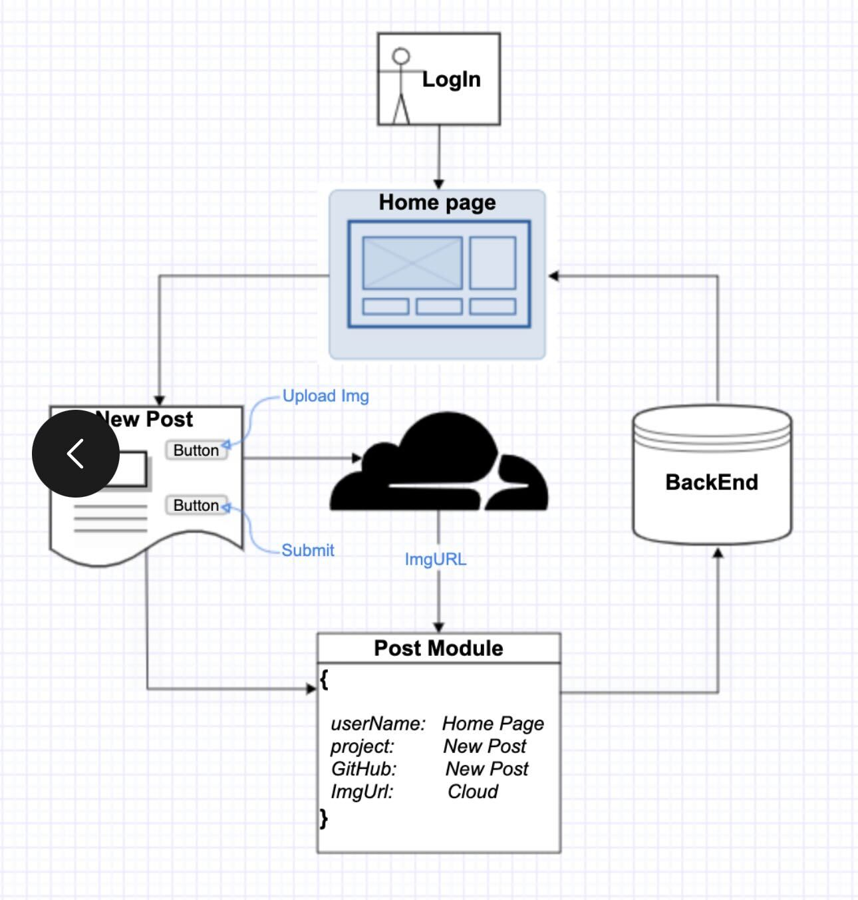

# Alike Backend

## Description

This is our Final Group project in our SEI bootcamp. The task was to create a clone of a social media platform and our group decided to recreate an instagram page but with our own twist on it. Our app is called Alike and it is targeted towards software engineers at any level. It is a site to display your projects in a social media environment. You can link your github repo so users can go to the project you posted and take a look at the code behind it and also browse through your README file. Alike is a great place for project exposure and also a place to meet people that you could collaborate with in the future. We hope every user can find it to be a valuable resource.

- GitHub Link: https://github.com/NickFasulo/BackEnd-Alike
- Heroku API Root Directory: https://backend-alike.herokuapp.com/

## API Navigation

Screenshots and API endpoints:

### **_ROOT API_**

### **_USERS_**

## Endpoints

To get started, navigate to the root path or insert one of the following paths into your browser:

1. Root Path: https://backend-alike.herokuapp.com/
2. User: https://backend-alike.herokuapp.com/user/
3. Post: https://backend-alike.herokuapp.com/post/
4. Comment: https://backend-alike.herokuapp.com/comment/
5. Admin: https://backend-alike.herokuapp.com/admin/
6. Token Obtain: https://backend-alike.herokuapp.com/api/token/
7. Token Refresh: https://backend-alike.herokuapp.com/api/token/refresh/

## Technical Notes

### Data

We created django models that convert to JSON on the front end. Our models are listed here.

User:

- username
- email
- password

Post:

- image
- github_link
- project_name
- username(ForeignKey links to user model)

Comment:

- username
- comment
- post(ForeignKey links to post model)

### Cloudinary

Cloudinary was used to allow users to upload photos of their projects from various sources. Here's an overview of the data flow.

### Dependencies

- Cors
- Dotenv
- Django
- Python
- Cloudinary
- Heroku CLI
- Knox
- Rest Framework
- PostgresSQL

## Future Features

- Full User Authorization
- Comments under Posts
- Functional profile pages
- Likes on Posts
- Tags for Posts

# Team

## **Anna Druzhinina**

LinkedIn: https://www.linkedin.com/in/anna-druzhinina/

GitHub: https://github.com/annadruzhinina

## **Argurjana Olloni**

LinkedIn: https://www.linkedin.com/in/aolloni/

GitHub: https://github.com/argurjanaolloni

## **Jose Calderon**

LinkedIn: https://www.linkedin.com/in/jose-a-calderon-software-engineer/

GitHub: https://github.com/HowzayCalderon

## **Nick Fasulo**

LinkedIn: https://www.linkedin.com/in/nicholas-fasulo/

GitHub: https://github.com/NickFasulo

## **Ron Lanzilotta**

LinkedIn: https://www.linkedin.com/in/ronlanzilotta/

GitHub: https://github.com/RonLanzilotta

## **Ryan Ehrlich**

LinkedIn: https://www.linkedin.com/in/ryanehrlich/

GitHub: https://github.com/Jagerziel

## **Vasilis Myrianthopoulos**

LinkedIn: https://www.linkedin.com/in/vasilis-myrianthopoulos/

GitHub: https://github.com/Vasilis89
