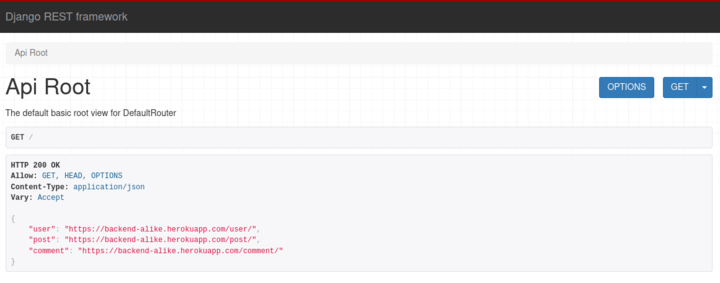
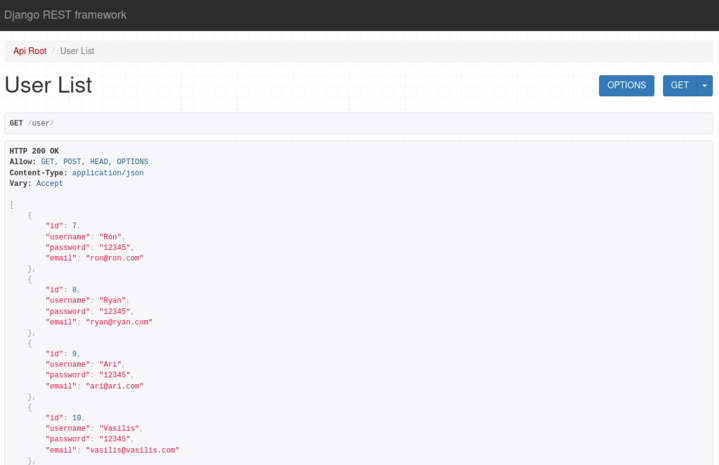
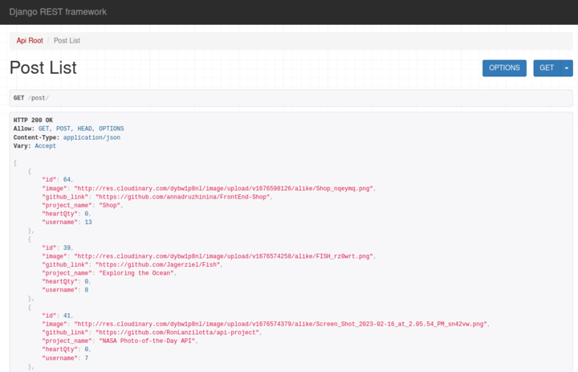
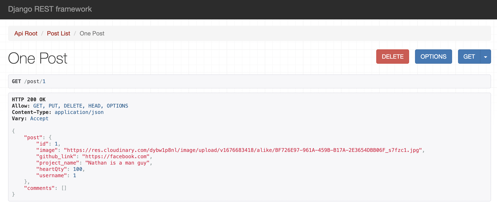
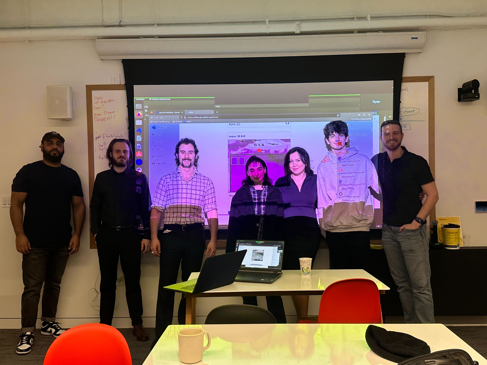

# Alike-Backend

## Description

Alike is a social media platform where innovative minds collaborate and share ideas to create the projects of tomorrow. The platform is deisgned so developers can showcase their projects, share their feedback, and keep up on all the latest technology. 

Built by developers - for developers!

- Backend GitHub Link: https://github.com/NickFasulo/BackEnd-Alike
- Frontend GitHub Link: https://github.com/annadruzhinina/FrontEnd-Alike/
- Heroku API Root Directory: https://backend-alike.herokuapp.com/

## API Screenshots and Endpoints

### ***ROOT API***

### ***USERS***

### ***POSTS***

### ***SINGLE POST***

## Endpoints

To get started, navigate to the root path or insert one of the following paths into your browser:

1. Root Path: https://backend-alike.herokuapp.com/
2. User: https://backend-alike.herokuapp.com/user/
3. All Posts: https://backend-alike.herokuapp.com/posts/
4. Single Post: https://backend-alike.herokuapp.com/post/:id
5. Comment: https://backend-alike.herokuapp.com/comment/
6. Admin: https://backend-alike.herokuapp.com/admin/

## Technical Notes

### ***Django Models***
 

***Django User:***

- username
- password

***User Profile:***

- username
- email
- password
- re_password

***Post:***

- image (cloudinary URL)
- github_link
- project_name
- heartQty
- username (ForeignKey links to user model)

***Comment:***

- username
- comment
- post (ForeignKey links to post model)

### ***Cloudinary***

Cloudinary was used to allow users to upload photos of their projects from multiple sources and apply parameters to those images. Here's an overview of the data flow.

### Dependencies

- Cloudinary
- Cors
- Django
- Dotenv
- Heroku CLI
- Knox
- PostgresSQL
- Psycopg2-binary
- Python
- Rest Framework

## Future Features

- Comments section associated with each Post
- Functional profile pages
- Searchable tags
- Pagination
- Direct messaging between users
- Archiving favorite projects
- Following user profiles
- Forums, groups
- Tracking a user's likes
- Friends list
- Superuser for site arbitration
- Avatars

# Team

## **Anna Druzhinina**

LinkedIn: https://www.linkedin.com/in/anna-druzhinina/

GitHub: https://github.com/annadruzhinina

## **Ron Lanzilotta**

LinkedIn: https://www.linkedin.com/in/ronlanzilotta/

GitHub: https://github.com/RonLanzilotta

## **Nick Fasulo**

LinkedIn: https://www.linkedin.com/in/nicholas-fasulo/

GitHub: https://github.com/NickFasulo

## **Vasilis Myrianthopoulos**

LinkedIn: https://www.linkedin.com/in/vasilis-myrianthopoulos/

GitHub: https://github.com/Vasilis89

## **Ryan Ehrlich**

LinkedIn: https://www.linkedin.com/in/ryanehrlich/

GitHub: https://github.com/Jagerziel

## **Jose Calderon**

LinkedIn: https://www.linkedin.com/in/jose-a-calderon-software-engineer/

GitHub: https://github.com/HowzayCalderon

## **Argurjana Olloni**

LinkedIn: https://www.linkedin.com/in/aolloni/

GitHub: https://github.com/argurjanaolloni

## **Alex Chang**

LinkedIn: https://www.linkedin.com/in/alexlchang/

GitHub: https://github.com/individual-ism

## ***TEAM***

